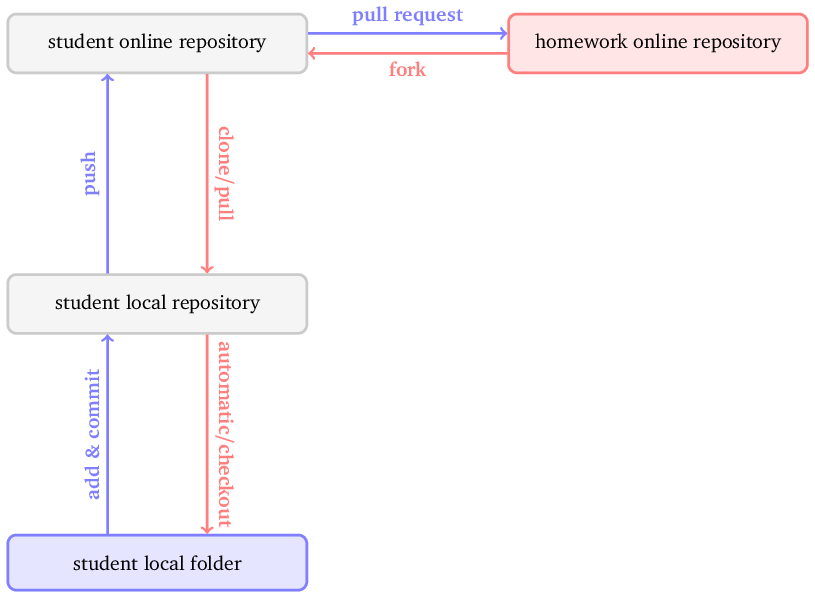

Homework 1
==========

Github Instructions
-------------------

1.  To start, [**fork** the repository][forking].
    Your account now contains a new online repository which is an exact copy of this one.
    Every folder corresponds to a homework exercise and contains one or more files.
    If the folder contains a file named *instructions.mdown*, check that one first.
    If no such file exists, the instructions are spread over the other files.
    You can [edit these files directly][ref-edit] in your repository, or you can first sync the repository to your computer so you can work on the assignments offline.

1.  If you want a local copy, proceed as follows:
    1.  Clone the forked repository to your computer.
        In your forked repository, click on the green button labeled *Clone or download* and copy the URL.
        Let's suppose that the URL is https://foo/bar.git for now.
        Then open a terminal and type
        ```
        git clone https://foo/bar.git
        ```
    1.  Edit the files.
    1.  Once you are ready to upload the homework, proceed as follows:
        1. Open a terminal and use `cd` to move into the local clone of your forked repository.
        For example, if you cloned the repository into the folder *hw1* under *Downloads*, the command is `cd Downloads/hw1`.
        1. Run `git add .` to indicate that all files should be added to the next revision snapshot.
        1. Run `git commit -m "some message"` to create a new revision snapshot.
        Replace *some message* by a meaningful description, e.g. *all exercises done* or *still need to add docstrings*.
        1. Run `git push origin master` to sync your local changes to the forked repository.
        1. If you make changes at a later point, repeat the previous steps of `git add .`, `git commit -m` and `git push origin master`.
    
1.  Once you have uploaded all your solutions, [create a **pull request**][pull-request] on the original homework repository to turn in the assignment.

The diagram below shows how files are being created and copied around by the various steps.



To learn more about `git`, check out the [interactive Github tutorial](https://try.github.io).

<!-- Links -->
[forking]: https://guides.github.com/activities/forking/
[ref-edit]: https://help.github.com/articles/editing-files-in-your-repository/
[pull-request]: https://help.github.com/articles/creating-a-pull-request
